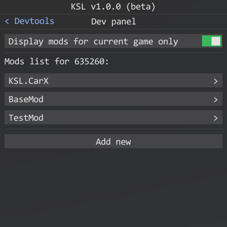
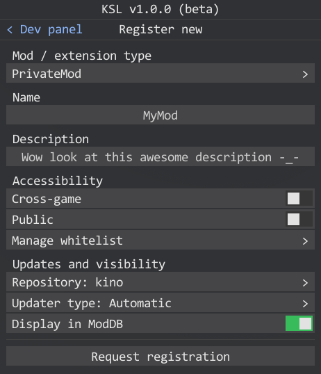
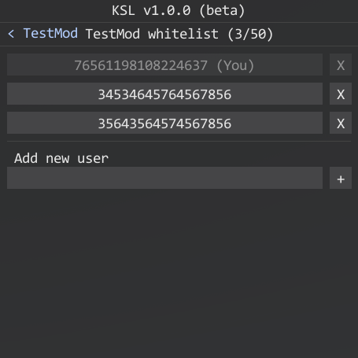
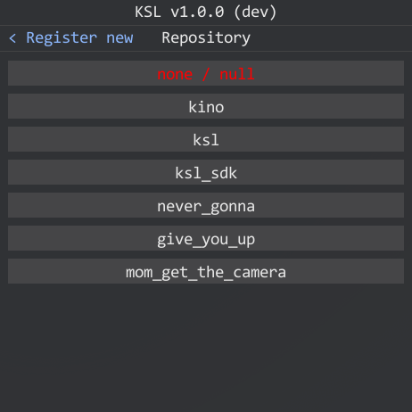
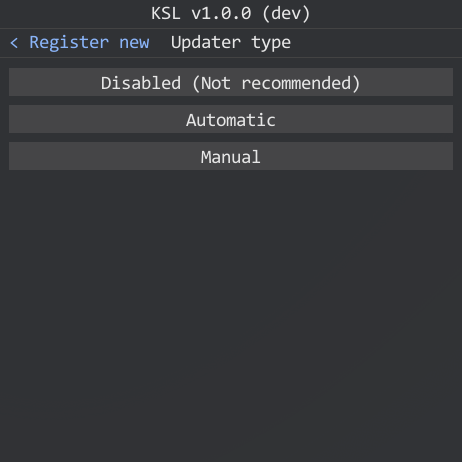
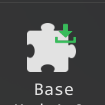
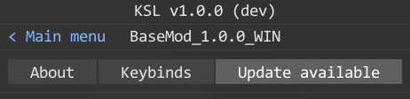
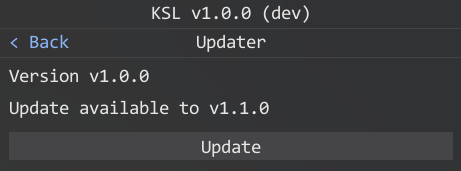
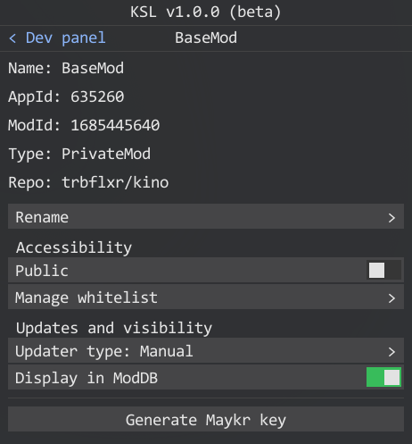

# KSL control panel

> [!IMPORTANT]  
> To have access to KSL control panned you have to get [developer rights](https://github.com/trbflxr/ksl/blob/master/doc/guide/dev/developer_rights.md) first.

In case if you already have developer rights you should be able to enable devtools in the [KSL settings](../setup.md#dev-settings).

From now you should see **Devtools** icon in the KSL main menu.

> [!NOTE]  
> Control panel are used for:
> * New mod / extensions [registration](#mod-registration)
> * [Management](#mod-management) of your mods / extensions:
> * Changing basic metadata, such as name, description
> * Accessibility configuration, you can make it public or private on fly
>   * [Whitelist](#whitelist-management) configuration (for private mods / extensions only)
>   * [Github repo](#repository-link) linkage
>   * [Updater](updater.md) configuration
>   * ModDB (WIP) discoverability
> * Maykr build key [generation](#generate-maykr-build-key)

Keep in mind that the listed changes are applied on the fly and will be available to mod / extension users after restarting the game.

## Mod registration

In this section you can register new mod / extension and configure them.

> [!NOTE]  
> Almost every parameter have a tooltip. If you are not sure what it do just hover a mouse over it for a sec.

Here you can:

* Select a type for you new mod / extension
* Set a name for it
* Add a description that the users will see
* Setup accessibility:
    * If it designed to work in multiple games, check **cross-game** toggle
    * Choose if it should be public or private
    * Add users to [whitelist](#whitelist-management) (for private only)
* Configure auto-updates:
    * Link one of your public repositories to it
    * Choose how it should be updated
* Choose whether you want it to be displayed in the ModDB (WIP)

> [!NOTE]  
> Keep in mind that most of the listed parameters can be changed later in the [mod control panel](#mod-management).

> [!NOTE]  
> **Github repository**: If you are not sure why it's needed consider to read more about KSL [update process](https://github.com/trbflxr/ksl/blob/master/doc/guide/dev/updater.md).

After you have completed the setup click on **Request registration** and if everything is filled in correctly, the new mod / extension will appear in the control panel.

### Whitelist management

To whitelist users you have to add their **SteamID64** to the list. And to remove users from the whitelist click on **X** near the SteamID.

If you are not sure how to get SteamID then you can use services like [steamid.io](https://steamid.io), [steamidfinder.com](https://steamidfinder.com) etc.

### Repository link

> [!IMPORTANT]  
> You can link repository only once. If you want to change it you have to open a [ticket](https://discord.com/channels/716264804498538516/818886497570521109) and request repository relink.

Here you can select repository that you want to link to the mod / extension. The repository list will be fetched automatically from github you provided when you requested the [dev rights](https://github.com/trbflxr/ksl/blob/master/doc/guide/dev/developer_rights.md).

### Updater type

> [!NOTE]  
> You can enable mod / extension updates only if you have repository linked to it.

By default all mods / extensions have updates disabled.

If you want to enforce users to always have the latest version installed select the **Automatic** update type.

In case if you want to let users choose whether they want to install the update or not, select **Manual** update type. KSL will still perform an automatic check for updates on the game start and mark mod / extension with an update icon so users will be notified that there is an update available. Then they can install it if the want in the mod menu.

Main menu icon:

Mod main menu header:

Mo updater:

---

## Mod management

In this section you can change the mod / extension name and description, configure accessibility and set up a [whitelist](#whitelist-management) if it's private.

You can configure how KSL should perform the [updates](#updater-type) for your mod / extension.

Also here you can link a [repository](#repository-link) if you haven't already.

And more importantly you can [generate a maykr key](#generate-maykr-build-key) to be able to build the mod / extension.

## Generate maykr build key

To generate [maykr](https://github.com/trbflxr/ksl/blob/master/doc/guide/dev/maykr.md) key first, make sure that all changes are saved (if not everything is saved, you will see the warning) and click on the **generate** button.

If the generation was successful you will be prompted to open the folder with the key. Otherwise you will see an error at the top of the menu.

> [!IMPORTANT]  
> Don't share keys with anyone. The exception would be members of the mod / extension development team.
>
> For each mod / extension you have to generate a new key.
>
> It is enough to generate the key once for a mod / extension.
