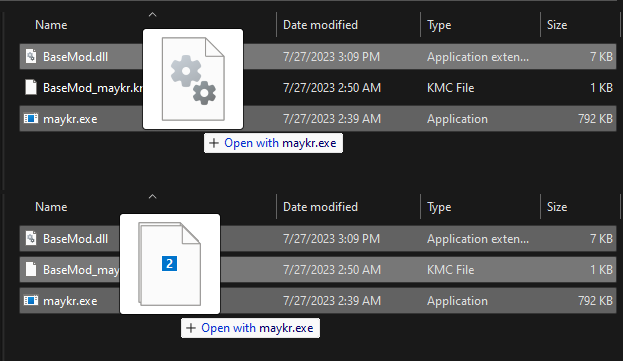
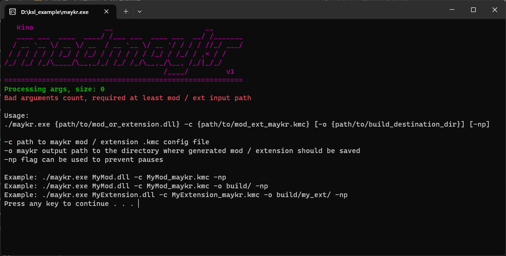
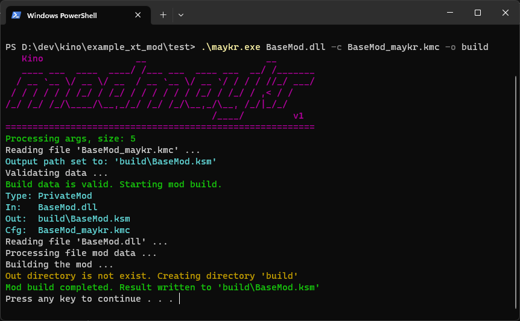

# KSL Maykr

> This tool is needed to build mods and extensions for KSL. You can download the tool as part of [SDK](https://github.com/trbflxr/ksl_sdk).

Maykr is a commandline tool for a final build of mods and extensions. You can easily include it in your current build pipeline.

> Before using make sure that you have [developer rights](developer_rights.md), that your mod / extension is [registered and configured](control_panel.md), and that you have [generated a key](control_panel.md#generate-maykr-build-key).

## How it works

To build mods / extensions you have to generate a key first. Find out how to do it [here](control_panel.md#generate-maykr-build-key).

Maykr needs at least a **build key** and a **path** to the original mod / extension .dll file to work.

If the key path is not explicitly specified with the ```-c {path/to/key.kmc}``` argument then maykr will search for it next to **.dll** file you specified to build.

You can read more about the maykr [usage](#usage) below.

## Usage

Here are 3 ways to use the maykr:

* Manually by [drag-n-dropping](#drag-n-drop-usage) files on it
* Manually using [commandline](#commandline-usage)
* Automatically by adding maykr to your [build pipeline](#add-maykr-to-build-pipeline)

### Drag-n-drop usage

You can build mods / extensions by drag-n-dropping them on the maykr executable.

> **Important:** To use it this way, the **.kmc** file has to be located near **.dll** and it has to be named in this exact format: **ModName_maykr.kmc**.
>
> Or you have to drag-n-drop both **.dll** and **.kmc** files on it.



### Commandline usage

You can double click on the maykr to open a console window with information on how-to-use.



Maykr needs at least a path to mod / extension **.dll** you want to build. If no other arguments are provided it will search for **.kmc** with the name of your **.dll** file and the output directory will be the maykr.exe location.

Here is an example usage of maykr:



Arguments:

* First argument is the original **.dll** file path
* **-c BaseMod_maykr.kmc** - explicit path to **.kmc** config file **(optional)**
* **-o build** - output folder where maykr should save the mod / extension build result **(optional)**
* **-np** - argument to prevent pause **(optional)**

> **Important:** If you want to add the maykr to your build pipeline make sure you added **-np** argument to prevent pause or your build will get stuck on waiting for maykr to exit.

Example usage:

```shell
./maykr.exe "MyMod.dll" -np
./maykr.exe "path/to/MyMod.dll" -o "path/to/output_dir" -np
./maykr.exe "MyExtension.dll" -c "path/to/MyExtension_maykr.kmc" -o "path/to/output_dir" -np
```

## Add maykr to build pipeline

You can easily add maykr to the build pipeline. Here is two options how you can do it.

> Note: You can automate it as you wish. The variants below are just some examples of how you can do it.

### Easy way

If you are solo developer and working only on one machine then this is the easiest way to use the maykr.

Add new **\<PropertyGroup>** to your **.csproj** file. Then add new **\<PostBuildEvent>** and call maykr in it with the path to mod / extension **.dll** file, path to [key file](control_panel.md#generate-maykr-build-key), output path and an **-np** argument.

Here is an example how to do it:

```xml

<Project>
    ...
    <PropertyGroup>
        <PostBuildEvent>$(SolutionDir)sdk/maykr.exe $(SolutionDir)build/$(Configuration)/Mod.dll -c $(SolutionDir)config/Mod_maykr.kmc -o game_path/kino/mods -np</PostBuildEvent>
    </PropertyGroup>
</Project>
```

Description:

* **$(SolutionDir)sdk/maykr.exe** - Path to maykr.exe. In this example KSL SDK are located in the sdk folder near to the main **.sln** file.
* **$(SolutionDir)build/$(Configuration)/Mod.dll** - Path to mod / extension **.dll** file.
* **-c $(SolutionDir)config/Mod_maykr.kmc** - Path to generated [key](control_panel.md#generate-maykr-build-key) file.
* **-o game_path/kino/mods** - Explicitly specified output path. In this case maykr will build the mod and put it in the **mods** folder.
* **-np** - Flag to prevent build pause.

> You can download example project [here](https://github.com/trbflxr/ksl_sdk).

### Advanced way

In case if you are working on multiple machines or in a team, hard coding output path in the **.csproj** file probably will not work for you. Since you can have different game paths on different machines the proper way will be to create some sort of local build configs.

There is no example on how to do it because it depends on the platform, installed and preferred software etc.

For an example you can create a **python** and call it in a **\<PostBuildEvent>** that will read a config file specifying the path to the game. This was the only thing that would be different on various systems would be the game path. Then run maykr from the script.

But as a team you probably already know how to setup build tools.
