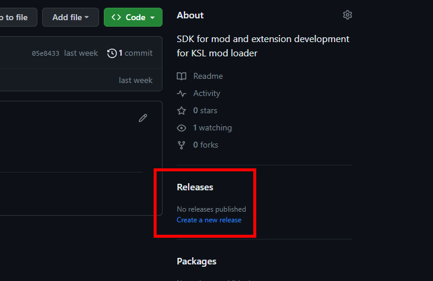
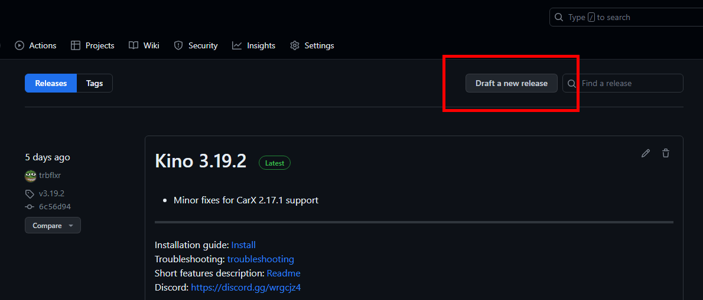
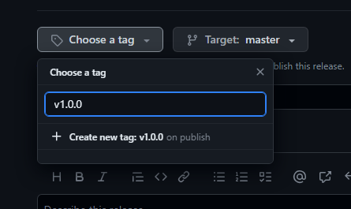
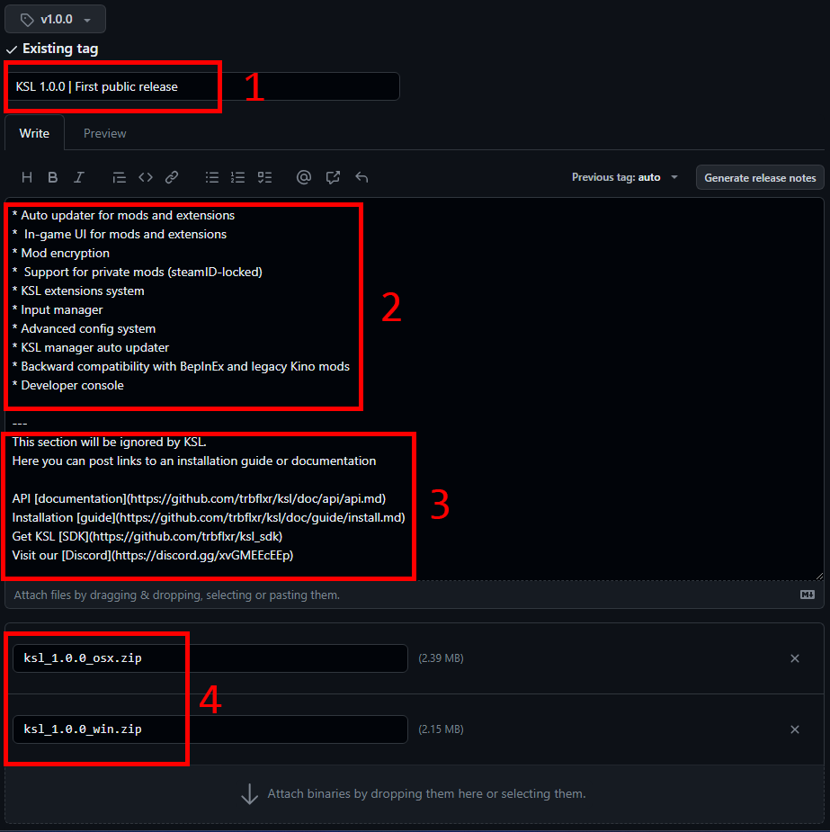

# Publish new release

When you are ready to release the build it's very important to do it in a proper way.

To make a release follow the steps below:

### 1. Go to repository releases page<br/> 

### 2. Depending on whether or not it's a first time you make a release you should select one of available options

* First release<br/> 
* Draft new<br/> 

### 3. Create a new release tag<br/> 

Latest release tag will be referenced by KSL updater as latest mod / extension version.

> Important: Tag have to be in format ```v*.*.*``` so KSL can parse the version properly. Example: **v1.2.5**, **v2.10.1**

### 4. Fill the release info<br/> 

1. Release title
2. Changelog
3. Additional information (optional)
4. Release [archive(s)](updater.md#release-archive)

> All the text below ```---``` will be ignored by KSL updater and the text above ```---``` will be displayed as a changelog.

At this point you can publish a new release and on the next game start KSL updater will be able to fetch it and perform an update if needed.
