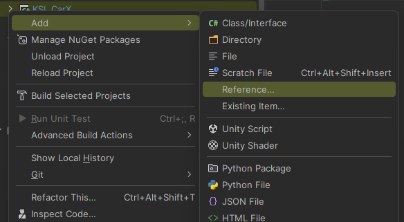
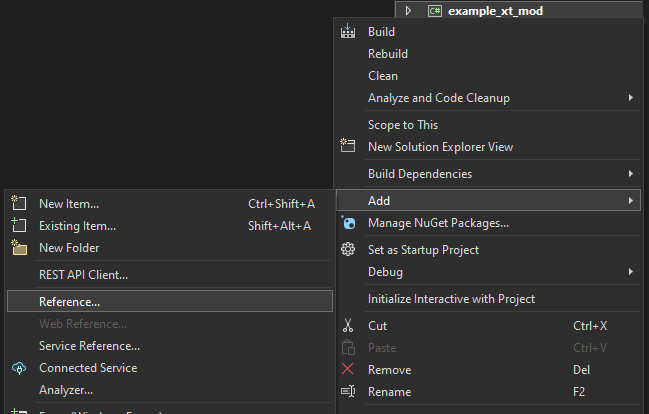

# Project setup

To develop mods for KSL, you should download KSL SDK fist. You can get it [here](https://github.com/trbflxr/ksl_sdk).

> [!NOTE]  
> You can add KSL SDK as git submodule. Learn more about git submodules [here](https://git-scm.com/book/en/v2/Git-Tools-Submodules).

Basic setup can be done by:

* [Setup dependencies](#setup-references)
* [Setup build tools](#setup-build-tools)

## Setup references

To create mods for KSL loader you mod must have a reference to **KSL.API.dll** and **UnityEngine.CoreModule.dll** which you can copy from your target games **Managed** folder.

Here is an example on how to add a reference in Rider and VisualStudio.

* For **Rider**   
  Then click **Add from...** and select then path to **KSL.API.dll**.
* For **VisualStudio**   
  Then click **Browse** and select the path to **KSL.API.dll**.

Also if you want to use [Harmony](https://github.com/pardeike/Harmony) you can add a reference to 0Harmony.dll in the same way.

> [!NOTE]  
> In order to see in-code documentation you can place **KSL.API.xml** near the **KSL.API.dll**.

## Setup build tools

All mod developers can load "raw" **.dll** files as mods / extensions. But for regular users all KSL mods and extensions should be built as **.ksm** and **.kse** respectively.

Learn how to setup and use KSL maykr [here](maykr.md).
