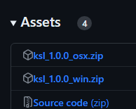
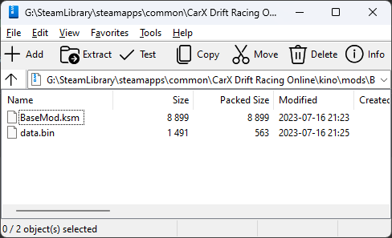
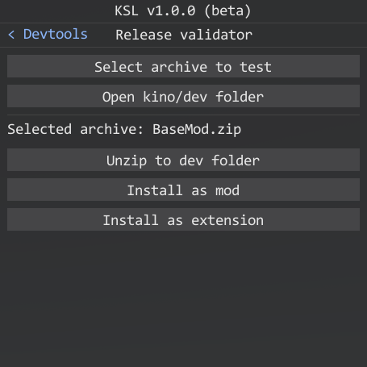

# KSL Updater

> [!NOTE]  
> Keep your mods and extensions updated!

KSL allows mod developers to keep their mods updated. To use the updater you have to complete the following steps:

* Create and setup a [github repository](#github-repository)
* Configure the updater in the [control panel](https://github.com/trbflxr/ksl/blob/master/doc/guide/dev/control_panel.md#mod-management)
* Build the mod / extension and create a [release archive](#release-archive)
* Publish a new [release](https://github.com/trbflxr/ksl/blob/master/doc/guide/dev/publish.md)

More on these steps below.

## Github repository

The repository itself can be empty and don't have to contain any source code. For correct KSL updater work it only has to contain **properly formatted releases**.

As an example you can check how the [kino mod](https://github.com/trbflxr/kino) is configured (an example of a closed-source mod).

If you are still not familiar with GitHub learn how to create a repository [here](https://docs.github.com/en/get-started/quickstart/create-a-repo).

> [!IMPORTANT]  
> The repository has to be **public**.

After repository is created you can create a [release archive](#release-archive).

## Release archive

### General info

> [!IMPORTANT]  
> * KSL supports only **.zip** archives
> * The archive should be **uncompressed** for extra assurance
> * KSL will unzip all the files and folders from the archive

When you have created a [mod](https://github.com/trbflxr/ksl/blob/master/doc/guide/dev/mods.md) or an [extension](https://github.com/trbflxr/ksl/blob/master/doc/guide/dev/extensions.md) build, you should zip it and all needed files to the **.zip** archive. You can do it using your build tools or manually.

Archive hierarchy is important. Please check this [note](https://github.com/trbflxr/ksl/blob/master/doc/guide/install_content.md#files-and-folders).

### Platform dependent mods

> [!NOTE]  
> If you want to make Windows only mods feel free to skip this section and continue to [archive creation](#create-and-test-release-archive).

KSL mods should be written using .NET Framework and it means that the mods should run on Windows and OSX games just fine without making making separate versions.

In case that you have to use platform dependent code then you have to build separate versions of the mod for each platform individually.

Users and KSL have to know which version to install. So we decided to use archive suffixes for platform dependent mods.

> [!NOTE]  
> If your mod is platform independent you don't need to do anything. Continue to [archive creation](#create-and-test-release-archive).

For windows you should put **_win** suffix in the archive name and for OSX use **_osx** suffix respectively.

Example:



### Create and test release archive

Now you can zip mod / extension and all the files needed by it in the **.zip** archive. Then give it a [proper name](#platform-dependent-mods) if your mod / extension is platform dependent and you are ready to publish it.

Archive example:



> [!NOTE]  
> But before publishing it is also good to test the installation and update process first.

You can test the update process using KSL devtools. Make sure you have it enabled in the ```KSL/Settings/Developer settings```.

By using this tool you can test the archive unzip process and also mod / extension installation and update.



## Publish release

Learn how to properly publish the mod / extension releases [here](https://github.com/trbflxr/ksl/blob/master/doc/guide/dev/publish.md).
