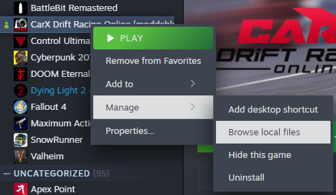

# KSL macOS installation guide

> [!NOTE]  
> The installation process will be shown using CarX as an example. The process is the same for all Unity games with **mono** runtime.

## 1. Download latest KSL release

Go to [**releases**](https://github.com/trbflxr/ksl/releases) and download the latest KSL release.

> [!IMPORTANT]  
> Keep in mind that for **macOS** you have to download the archive with **osx** suffix.


## 2. Open the game folder



## 3. Extract the downloaded archive and drag its contents to the application folder


Replace all the files if needed.


## 4. Open the run_ksx.sh file in a text editor


## 5. Edit the run_ksx.sh file

Edit **only** this line to include the game .app name.
In this example: "CarX Drift Racing Online.app"


Save the file and close the editor.

## 6. Update the run_ksx.sh file permissions

First copy the application folder path. To do it use <kbd>Option</kbd> + <kbd>Command</kbd> + <kbd>C</kbd> combination.

Open spotlight search using <kbd>Command</kbd> + <kbd>Space</kbd> and type "terminal" in it.


Type ```cd "<Paste the path from clipboard here>"``` and press <kbd>Return</kbd>.


Type ```chmod +x run_ksl.sh``` and press <kbd>Return</kbd>. It will add execute permission to the script.

## Installation completed

From this point you can start the game from the terminal with KSL enabled and from steam to play without the mods.

But there is an optional step to start the game with mods from steam.

Select the run_ksx.sh file and press <kbd>Option</kbd> + <kbd>Command</kbd> + <kbd>C</kbd> to copy it's path.


Open application properties


Add a launch option for the game. First open double quotes and paste the path you copied in it. Then add space and ```%command%```.
It should look like this ```"/Users/trbflxr/Work/carx/run_ksl.sh" %command%```

Done. Now you can launch the game with KSL enabled from the steam application.
