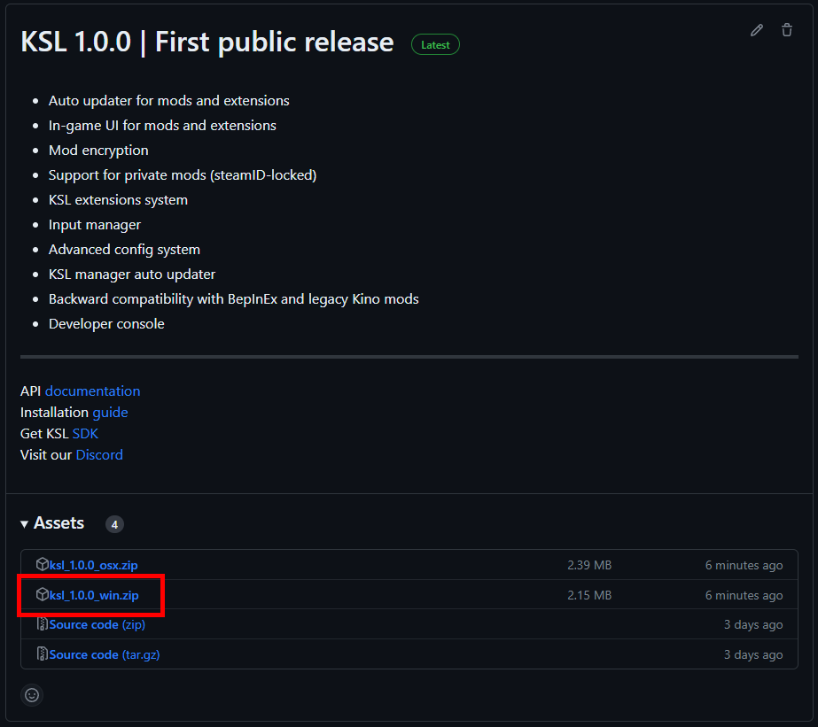
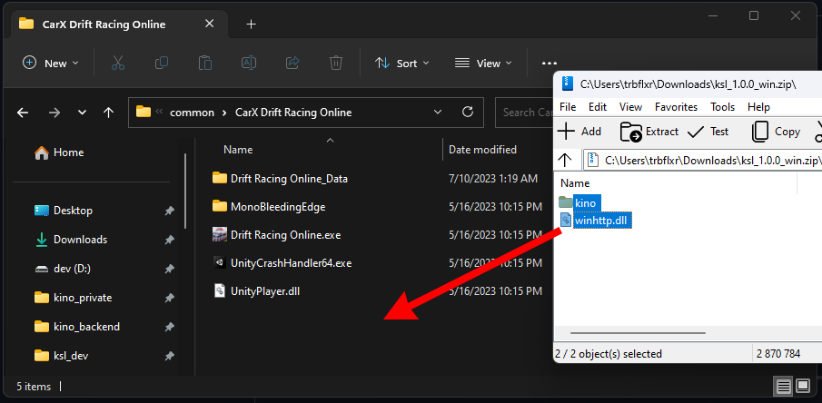
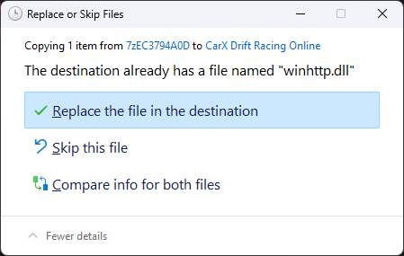

# KSL Windows installation guide

> The installation process will be shown using CarX as an example. The process is the same for all Unity games with **mono** runtime.

## 1. Download latest KSL release

Go to [**releases**](https://github.com/trbflxr/ksl/releases) and download latest KSL release.

> [!IMPORTANT]  
> Keep in mind that for **Windows** OS you have to download the archive with **win** suffix.

## 2. Open game folder

## 3. Open the downloaded archive and extract its contents

Drag all the files and folders from the archive to the game root folder.

Replace all the files if needed.

## 4. Start the game
