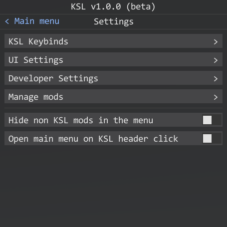
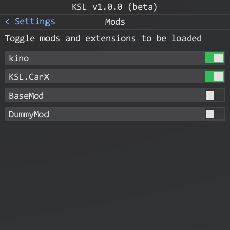
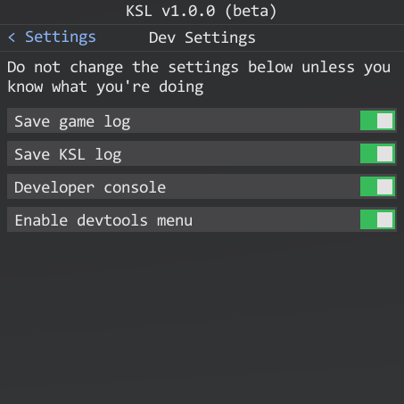

# KSL Settings

Here you can edit the KSL Mod Loader configuration. More settings for the loader will be added later. For now we will cover the basic settings for the developer.

### Mods / extensions toggle

Here you can toggle mods / extensions that should be loaded. No need to drag it out of the **mods** folder just flip the switch here.

### Dev settings

Here you can toggle the logs that KSL should save on the disc. Also you can toggle the developer console to make mod creation easier. And enable or disable [KSL devtools](dev/control_panel.md).

